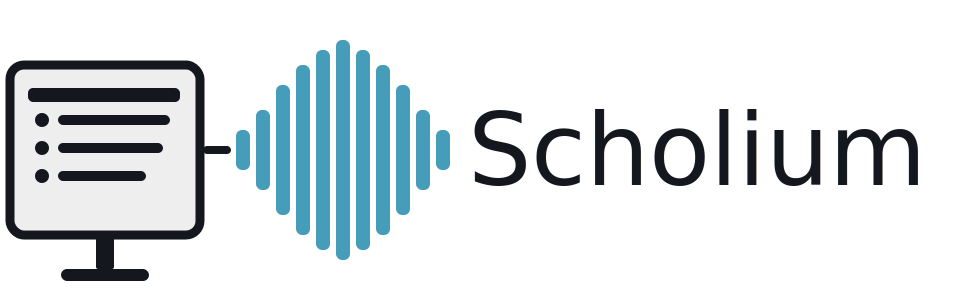
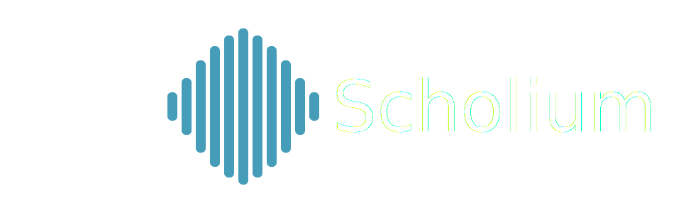

.. raw:: html

   

Scholium Documentation
======================

|

**Automated instructional video generation from markdown slides with embedded narration.**

.. raw:: html

   

     <video controls width="100%" style="border-radius: 8px; display: block;">
       <source src="demo.mp4" type="video/mp4">
     </video>
   

.. epigraph::

   *Scholium* (Greek: σχόλιον) — An explanatory note or commentary.
   Your digital scholium for the modern classroom.

Scholium transforms markdown slides with embedded ``:::notes:::`` blocks into professional narrated instructional videos using AI voice synthesis.

.. image:: https://img.shields.io/badge/python-3.11+-blue.svg
   :target: https://www.python.org/downloads/
   :alt: Python 3.11+

.. image:: https://img.shields.io/badge/License-MIT-yellow.svg
   :target: https://opensource.org/licenses/MIT
   :alt: License: MIT

Quick Start
-----------

Installation::

    pip install scholium[piper]

Create a lecture in ``lecture.md``::

    ---
    title: "Python Functions"
    title_notes: |
      Welcome to this lesson on Python functions.
    ---
    
    # What is a Function?
    
    A reusable block of code.
    
    ::: notes
    Functions are fundamental building blocks in Python.
    They let you organize code into reusable pieces.
    :::

Generate video::

    scholium generate lecture.md output.mp4

.. toctree::
   :hidden:
   :maxdepth: 1

   getting_started
   user/index
   reference
   resources

Key Features
------------

**Unified Markdown Format**
   Write slides and narration together using ``:::notes:::`` blocks.

**Advanced Timing Control**
   Precise control over slide duration and pauses::

      ::: notes
      [PRE 2s] [POST 3s] [MIN 10s]
      
      Narration with timing directives.
      :::

**Incremental Reveals**
   Synchronized bullet-by-bullet reveals::

      >- First point
      >- Second point
      >- Third point
      
      ::: notes
      Narration for first point.
      
      Narration for second point.
      
      Narration for third point.
      :::

**Multiple TTS Providers**
   Choose from eight text-to-speech (TTS) engines — local or cloud, free or commercial:
   
   * Piper - Fast, local, recommended for beginners
   * ElevenLabs - Highest quality cloud API
   * Coqui - Local voice cloning from audio samples
   * OpenAI - Latest TTS models
   * Bark - Highest quality local (slow)

Indices and tables
==================

* :ref:`genindex`
* :ref:`modindex`
* :ref:`search`
